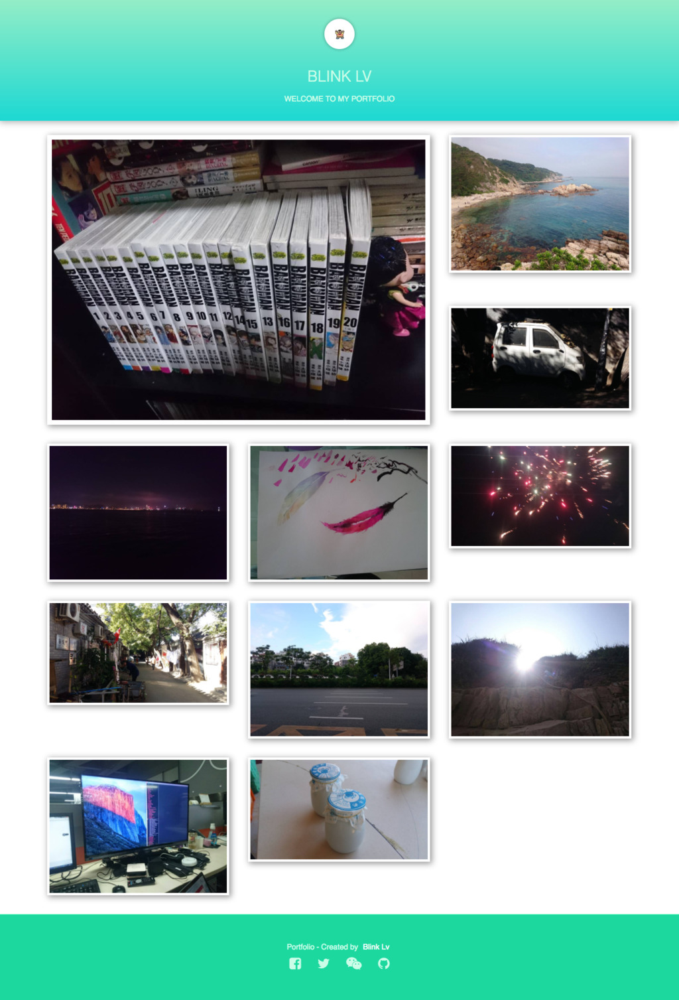

# Portfolio

A portfolio demo used to show pictures, it's a responsive web page.  If you want to change    
it for yourself, you need to replace the contents of the **img** directory (include the **description**   
directory). The **logo.jpg** picture will become your logo on the header, you also need to  
change the *index.pug* file a little bit to make the information under the logo meet your   
requirements. The site looks like below (only in desktop).

If you change the device (likes tablet, phone), it will be showed differently. Waiting for you to dig it :smirk:.
